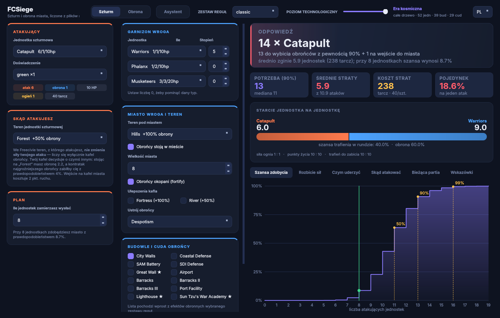
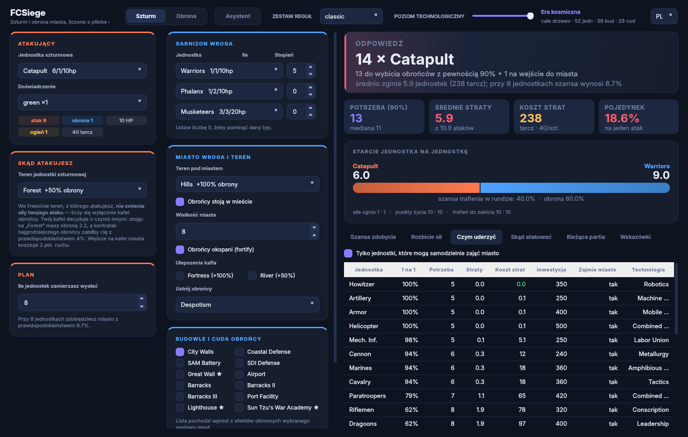
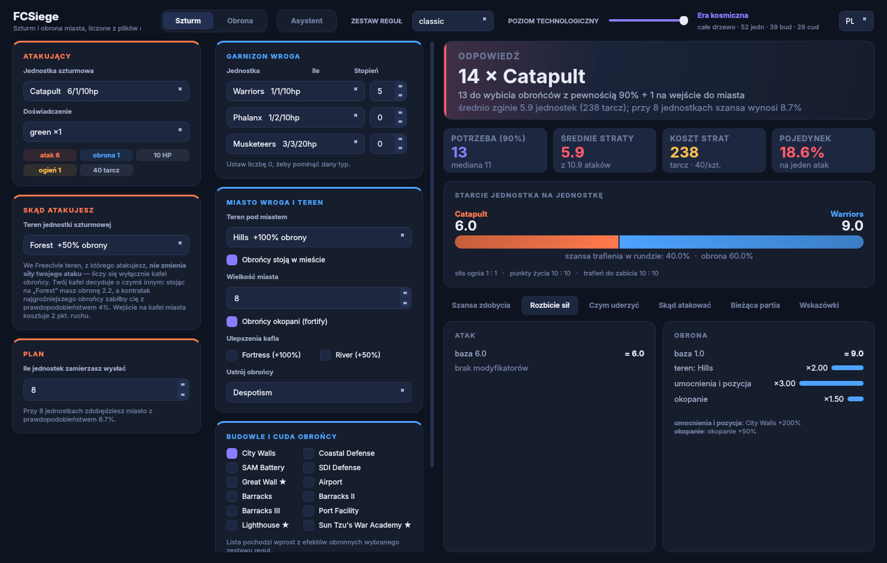
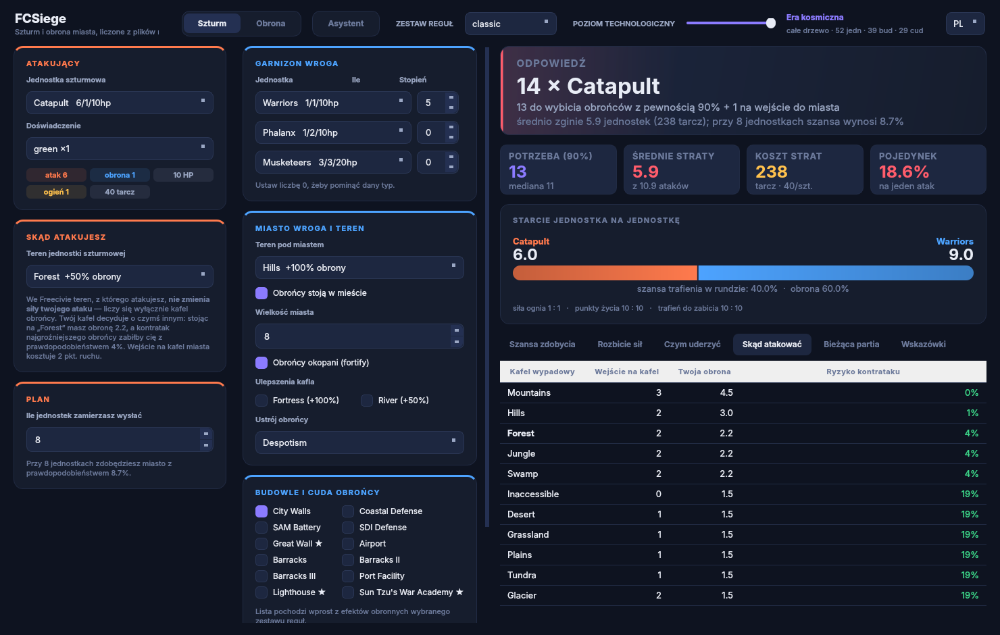
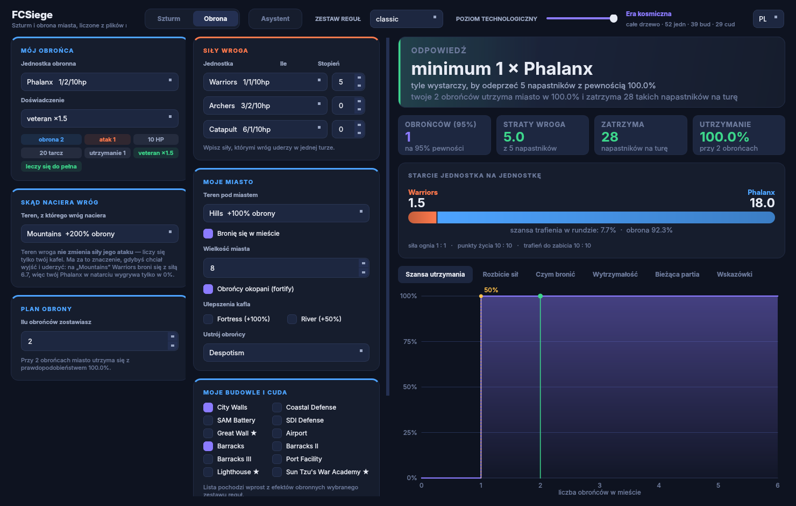
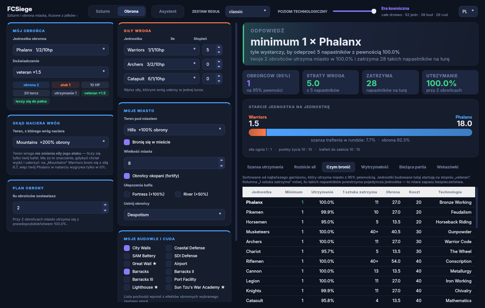
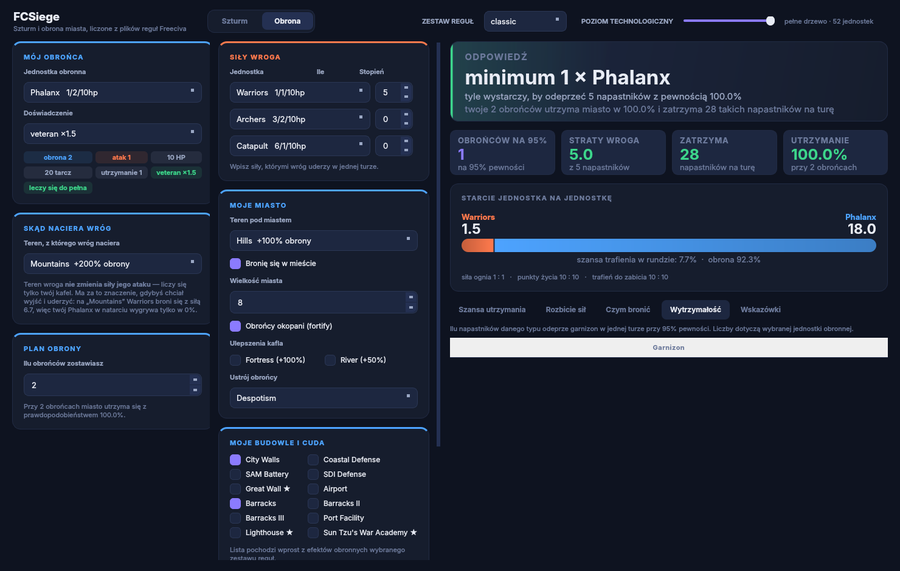
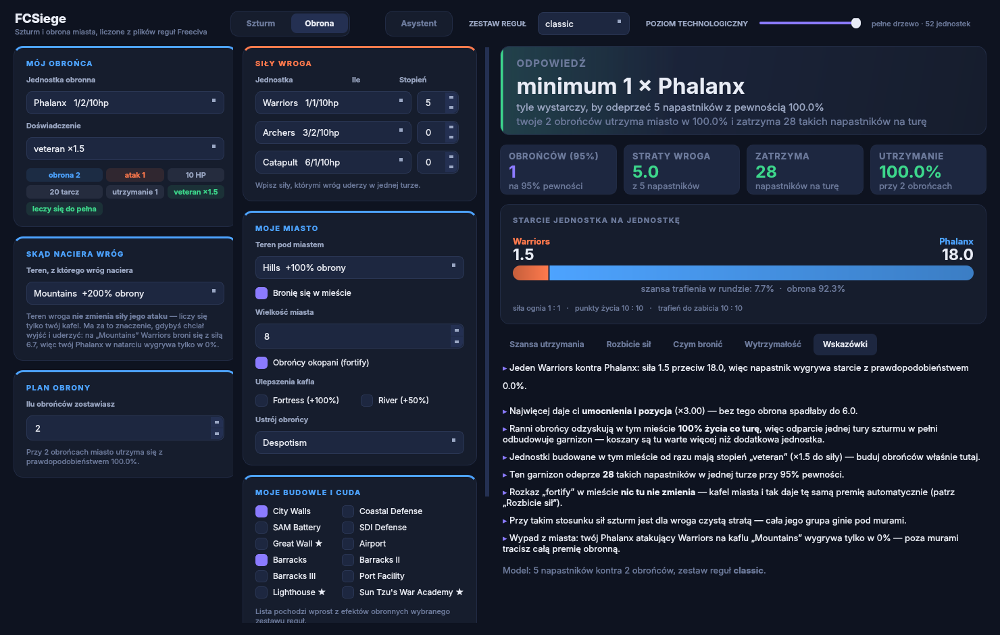
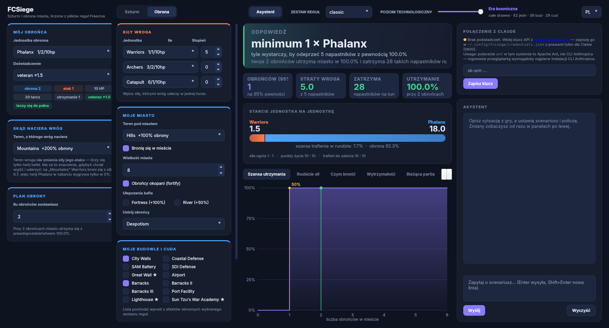

# FCSiege

Kalkulator walki o miasto dla [Freeciva](https://www.freeciv.org/). Odpowiada na
dwa pytania:

* **Szturm** — ile jednostek muszę poświęcić, żeby zdobyć to miasto?
* **Obrona** — ile jednostek i jakich muszę zostawić, żeby wróg go nie zajął?

Można je zadać klikając w panelach albo **napisać zwykłym zdaniem do wbudowanego
asystenta**, który sam ustawi scenariusz i policzy.

Wszystko liczone z oryginalnych plików `.ruleset`, więc wynik naprawdę zależy od
zestawu reguł, na którym grasz.



## Uruchomienie

```bash
git clone https://github.com/dominikmaslak11/fcsiege.git
cd fcsiege
pip install PySide6 numpy      # jeśli jeszcze ich nie masz
pip install anthropic mcp      # opcjonalnie: asystent i serwer MCP
python3 fcsiege.py
```

Wymaga Pythona 3.10+. Bez `anthropic` działa wszystko poza czatem, bez `mcp` —
wszystko poza serwerem MCP.

Cztery sposoby uruchomienia:

```bash
python3 fcsiege.py             # okno aplikacji
python3 fcsiege.py --control   # okno + gniazdo sterujące (dla MCP i API)
python3 fcsiege.py mcp         # serwer MCP po stdio
python3 fcsiege.py api         # API HTTP na 127.0.0.1:8765
```

## Języki

Interfejs, narzędzia asystenta i API mówią po polsku albo po angielsku.

```bash
python3 fcsiege.py --lang=en          # okno po angielsku
FCSIEGE_LANG=en python3 fcsiege.py    # to samo przez zmienną środowiska
python3 fcsiege.py mcp --lang=en      # serwer MCP
curl "localhost:8765/state?lang=en"   # API: parametr albo Accept-Language
```

W oknie służy do tego przełącznik `PL / EN` w prawym górnym rogu; zmiana buduje
okno od nowa i przenosi scenariusz tym samym zrzutem, którego używa asystent.

Tłumaczone są trzy warstwy: napisy w oknie, **klucze i wartości w odpowiedziach
narzędzi** oraz nazwy i opisy narzędzi (`policz` ↔ `compute`). Nazwy z zestawu
reguł — `Monarchy`, `Output_Bonus`, `Knights` — zostają nietknięte, bo należą do
gry, nie do aplikacji. Polski jest językiem źródłowym: kluczem w katalogu jest
sam polski napis, więc kod czyta się tak samo jak wcześniej.

Test `tests/test_i18n.py` pilnuje, żeby każdy napis owinięty w `_()` miał
tłumaczenie — bez tego angielski interfejs po cichu gubiłby pojedyncze zdania.

## Zestawy reguł

Aplikacja szuka zestawów w tej kolejności:

```
<repo>/data/rulesets/          siedem zestawów z dystrybucji Freeciva
~/.freeciv/<wersja>/           zestawy doinstalowane instalatorem modpacków
~/.local/share/freeciv/<wersja>/
/usr/share/freeciv/
$FREECIV_DATA_PATH             ma pierwszeństwo przed wszystkim
```

Instalator modpacków Freeciva wrzuca zestawy do katalogu z **numerem wersji**
(`~/.freeciv/3.2/ancients`), dlatego przeszukujemy też podkatalogi, a nie samą
ścieżkę bazową.

Nazwy epok na suwaku pochodzą z drabiny historycznej ogólnego przeznaczenia,
a progi liczymy z faktycznego drzewa danego zestawu. Gdy któraś epoka wypada
w innym miejscu niż w historii — jak `Wiek odkryć` w zestawie `ancients`,
o 29 poziomów przed `Średniowieczem` — narzędzie `epoki` mówi o tym wprost,
zamiast udawać, że etykiety pasują.

## Skąd biorą się liczby

Aplikacja **nie ma zaszytej ani jednej statystyki**. Przy starcie parsuje pliki
`.ruleset` (`units`, `terrain`, `buildings`, `effects`, `techs`, `game`,
`governments`) i z nich buduje model walki. Ten sam scenariusz — 5 wojowników
w mieście na wzgórzu z murami — wygląda tak:

| ruleset | obrona | dlaczego |
|---|---|---|
| classic | **9.0** | wzgórze ×2, mury ×3, okopanie ×1.5 |
| sandbox / civ2civ3 | **5.5** | wzgórze ×1.5, a miasto +50% i mury +100% **sumują się** do ×2.5 |
| civ2 | **6.0** | mury kasują premię za okopanie |

Dołączone zestawy: `classic`, `sandbox`, `civ2civ3`, `multiplayer`, `civ1`,
`civ2`, `alien`. Aplikacja szuka też zestawów w `~/.local/share/freeciv`,
`/usr/share/freeciv` i w katalogach ze zmiennej `FREECIV_DATA_PATH`, więc widzi
również Twoje własne mody.

## Tryb szturmu

Wybierasz jednostkę, garnizon wroga, teren i budowle — dostajesz liczbę jednostek
potrzebnych na 90% pewności, oczekiwane straty i pełną krzywą prawdopodobieństwa.

Zakładka **Czym uderzyć** szereguje wszystkie dostępne jednostki według realnego
kosztu strat i inwestycji w tarczach:



Zakładka **Rozbicie sił** pokazuje, skąd wzięła się każda liczba — z jawnym
rozbiciem na poszczególne efekty:



### Teren, z którego atakujesz

We Freecivie teren atakującego **nie zmienia siły ataku** — liczy się wyłącznie
kafel obrońcy. Zakładka **Skąd atakować** pokazuje więc to, na co ten kafel
naprawdę wpływa: koszt wejścia, Twoją obronę i ryzyko śmierci przy kontrataku.



## Tryb obrony

Role się odwracają: opisujesz siły wroga i swoje miasto, a aplikacja podaje
**minimalny garnizon**, który je utrzyma.



Zakładka **Czym bronić** szereguje jednostki od najtańszego garnizonu, który
wystarczy — z kolumną „1 sztuka zatrzyma”, czyli miarą zapasu bezpieczeństwa:



Zakładka **Wytrzymałość** to najbardziej praktyczna tabela w całym programie:
ilu napastników każdego typu odeprze garnizon danej wielkości.



Wskazówki odpowiadają też na pytania, które łatwo przeoczyć — na przykład czy
rozkaz `fortify` w mieście cokolwiek daje (w `classic`, `sandbox` i `civ2civ3`
**nie daje nic**, bo kafel miasta przyznaje tę samą premię automatycznie):



## Asystent

Przycisk **Asystent** w nagłówku otwiera czat. Opisujesz sytuację zwykłym
zdaniem, a model ustawia scenariusz i uruchamia obliczenia — zmiany widać na
żywo w panelach po lewej, bo asystent klika w ten sam interfejs co Ty.



**Model:** `claude-opus-5`, adaptacyjne myślenie, odpowiedź strumieniowana.
Włączony jest serwerowy `fallbacks: "default"` — gdy klasyfikator bezpieczeństwa
odrzuci zapytanie, API automatycznie przenosi je na model zapasowy.

**Logowanie.** Aplikacja szuka poświadczeń w kolejności: zmienna
`ANTHROPIC_API_KEY` → klucz zapisany w `~/.config/fcsiege/credentials.json`
(prawa 0600) → profil OAuth z `~/.config/anthropic` (zakładany przez CLI
Anthropica poleceniem `ant auth login`). Jeśli nic nie znajdzie, panel czatu
poprosi o klucz z [console.claude.com](https://console.claude.com/settings/keys).

> Uwaga: w wielu dystrybucjach polecenie `ant` to **Apache Ant**, nie CLI
> Anthropica. Aplikacja to wykrywa i mówi wprost, której drogi logowania
> możesz użyć.

**Czym asystent steruje** (18 narzędzi): `pokaz_stan`, `ustaw_scenariusz`,
`ustaw_moja_jednostke`, `ustaw_sily_wroga`, `policz`, `ranking`,
`tabela_wytrzymalosci`, `dane_jednostki`, `spis`, oraz wywiad z zapisu gry:
`wczytaj_zapis`, `moje_wojska`, `wywiad_o_nacji`, `linia_frontu`,
`porownaj_ustroje`, `przejezdnosc`, `audyt_miast`, `co_da_rozwiazanie`, `szlaki_handlowe`.

Wszystkie liczby pochodzą z tego samego silnika co panele — prompt systemowy
zabrania modelowi szacowania wyników walki z pamięci. Narzędzia wykonują się
w wątku interfejsu, więc czat i klikanie nigdy nie rozjeżdżają się ze sobą.

**Co jest wysyłane:** treść rozmowy i ustawienia scenariusza (jednostki, teren,
budowle) trafiają do API Anthropic. Bez otwarcia czatu aplikacja nie łączy się
z siecią w ogóle.

## Serwer MCP

Ten sam kalkulator jako serwer [MCP](https://modelcontextprotocol.io/) — Claude
Code, Claude Desktop czy dowolny inny klient MCP może liczyć scenariusze bez
otwierania aplikacji.

```bash
claude mcp add fcsiege -- python3 /ścieżka/do/fcsiege/fcsiege.py mcp --ruleset sandbox
```

Konfiguracja Claude Desktop (`~/.config/Claude/claude_desktop_config.json`):

```json
{
  "mcpServers": {
    "fcsiege": {
      "command": "python3",
      "args": ["/ścieżka/do/fcsiege/fcsiege.py", "mcp", "--ruleset", "sandbox"]
    }
  }
}
```

Domyślnie (`--attach auto`) serwer liczy we własnym stanie. Jeśli jednak
aplikacja działa z `--control`, narzędzia idą do niej — wtedy **Claude przestawia
kontrolki w oknie, które masz przed sobą**, a wynik mówi, skąd pochodzi
(pole `zrodlo`). `--attach nigdy` wymusza tryb lokalny.

## API HTTP

Dla skryptów, botów i wszystkiego, co nie mówi po MCP. Tylko biblioteka
standardowa, domyślnie nasłuchuje wyłącznie na `127.0.0.1`.

```bash
python3 fcsiege.py api --port 8765 --token tajne
```

```bash
curl -s localhost:8765/policz -H "Authorization: Bearer tajne" \
  -H 'Content-Type: application/json' -d '{"scenariusz":{
    "tryb":"szturm","teren_miasta":"Hills","budowle":["City Walls"],
    "moja_jednostka":{"jednostka":"Catapult"},
    "sily_wroga":[{"jednostka":"Warriors","liczba":5}]}}'
```

| ścieżka | co robi |
|---|---|
| `GET /zdrowie` | czy żyje i skąd liczy |
| `GET /narzedzia` | definicje narzędzi (te same, co w MCP) |
| `GET /openapi.json` | schemat OpenAPI 3.1 wygenerowany z definicji |
| `GET /stan` | obecny scenariusz |
| `POST /narzedzie/<nazwa>` | wywołanie narzędzia, ciało = argumenty |
| `POST /policz` | skrót: ustawia scenariusz i od razu liczy |

Token jest opcjonalny lokalnie, ale wymagany, jeśli wystawiasz `--host` poza
localhost — serwer ostrzega, gdy tego nie zrobisz.

## Wiele silników: Claude, GPT, Gemini, DeepSeek

Klucze trzyma jeden plik `~/.config/fcsiege/credentials.json` z prawami **0600**.
Zmienna środowiskowa zawsze ma pierwszeństwo przed plikiem.

```bash
python3 fcsiege.py klucz              # stan wszystkich dostawców
python3 fcsiege.py klucz gemini       # klucz czytany przez getpass, nie trafia
                                      # ani na ekran, ani do historii powłoki
```

W przeglądarce służy do tego panel **Ustawienia → Modele i klucze**.

| dostawca | protokół | domyślny model |
|---|---|---|
| Claude | oficjalne SDK Anthropica | `claude-opus-5` |
| OpenAI | zgodny `/chat/completions` | `gpt-5` |
| Gemini | zgodny `/chat/completions` | `gemini-3.1-pro-preview` |
| DeepSeek | zgodny `/chat/completions` | `deepseek-chat` |

Claude idzie własnym SDK, bo jego protokół niesie bloki myśli, buforowanie
promptu i serwerowy fallback — spłaszczanie tego do wspólnego mianownika
byłoby stratą. Pozostała trójka mówi tym samym protokołem, więc obsługuje ją
**jedna implementacja po HTTP ze standardowej biblioteki**, bez zależności.

Wszystkie cztery prowadzą **pełną pętlę 29 narzędzi**. Dwie rzeczy wyszły
dopiero na żywym API i są odwzorowane w kodzie:

* OpenAI odrzuca `max_tokens` dla nowszych modeli i wymaga
  `max_completion_tokens` — stąd pole `token_param` przy dostawcy,
* Gemini 3.x wymaga **odesłania własnej sygnatury rozumowania**
  (`extra_content.google.thought_signature`) razem z wywołaniem funkcji;
  bez tego druga runda kończy się błędem 400.

### Porównanie silników

```
POST /porownaj   {"tekst": "…"}
```

To samo pytanie idzie równolegle do wszystkich skonfigurowanych silników,
a odpowiedzi wracają obok siebie razem z listą użytych narzędzi i liczbami,
co do których wszystkie się zgadzają. **Świadomie nie wybieramy „najlepszej"
odpowiedzi automatycznie** — to byłoby udawanie sądu, którego nie ma jak
uzasadnić. Rozjazd między silnikami jest informacją sam w sobie.

### Bezpieczeństwo kluczy

* Model **nie może** ustawić ani odczytać klucza. Narzędzie `dostawcy` jest
  wyłącznie do odczytu i pokazuje jedynie, czy klucz istnieje i skąd pochodzi.
* Klucze przyjmuje wyłącznie `POST /dostawcy/<nazwa>` (za tokenem API) albo
  wiersz poleceń — nigdy droga, którą model mógłby wywołać.
* `.gitignore` blokuje `API_Keys.txt`, `*api*key*.txt` i `credentials.json`.

## Interfejs webowy przez Tailscale

Silnik zostaje na komputerze — tam, gdzie leżą zapisy gry — a telefon jest
cienkim klientem. Nic nie trzeba synchronizować i nic nie wychodzi do internetu.

```bash
python3 fcsiege.py api --tailscale
```

Serwer sam znajduje adres tego komputera w tailnecie (`tailscale ip -4`, a gdy
CLI nie ma — adres z zakresu CGNAT `100.64.0.0/10`), losuje token na tę sesję
i wypisuje link:

```
FCSiege API słucha na http://100.x.y.z:8765 (źródło: okno aplikacji)
Interfejs webowy: http://100.x.y.z:8765/ui
Link z tokenem (jednorazowy, potraktuj jak hasło):
  http://100.x.y.z:8765/ui?token=…
```

Otwierasz ten link na telefonie raz — strona chowa token w `localStorage`
i wymazuje go z paska adresu, żeby nie został w historii. Potem wystarczy
`http://100.x.y.z:8765/ui`.

Strona ma trzy zakładki: **Partia** (wczytanie zapisu, przełącznik pełnego
wglądu, raporty), **Kalkulator** (scenariusz i obliczenie) oraz **Asystent**
(czat ze strumieniowaniem, z podglądem wywoływanych narzędzi). Jest jednym
plikiem bez żadnych zewnętrznych zasobów — działa też, gdy telefon nie ma
internetu, byle był w tailnecie.

**Najważniejsze:** przy `--attach auto` (domyślnie) żądania z telefonu sterują
**otwartym oknem aplikacji** — przestawiają w nim kontrolki i czytają jego stan.
Telefon i komputer patrzą na jedną partię, nie na dwie kopie.

### Pełna analiza online

```
GET /analiza          (albo /analysis?lang=en)
```

Jedno żądanie liczy komplet: ostrzeżenia, układy dyplomatyczne, potencjał
wzrostu z planem robót, korupcję i logistykę. Każda sekcja liczona osobno
i osobno łapie błąd, żeby jedna niedostępna analiza nie wywaliła raportu.
Całość zajmuje około sekundy.

Interfejs webowy ma zakładkę **Analiza** z przyciskiem odświeżania, a poza tym
**przelicza wszystko sam po każdej nowej turze** — strumień `/zdarzenia`
sygnalizuje nowy zapis, a strona od razu odpytuje `/analiza`.

### Bezpieczeństwo

* Bez `--tailscale` serwer nasłuchuje tylko na `127.0.0.1`.
* Wystawienie poza localhost bez tokenu kończy się ostrzeżeniem na stderr.
* **Sama strona** wychodzi bez tokenu — inaczej przeglądarka nie miałaby jak
  o token poprosić. Nie ma w niej żadnych danych partii; **każde** żądanie
  o dane wymaga nagłówka `Authorization: Bearer …`.
* Bind na adres z tailnetu, nie na `0.0.0.0` — Tailscale daje szyfrowanie
  WireGuardem i tożsamość urządzenia, więc nic nie musi być publiczne.

### Czat po HTTP

```
POST /czat            {"tekst": "…", "sesja": "web", "wyczysc": false}
     -> text/event-stream
        data: {"typ":"tool_start","nazwa":"korupcja","argumenty":"{}"}
        data: {"typ":"tool_end","nazwa":"korupcja"}
        data: {"typ":"delta","tekst":"…"}
        data: {"typ":"done"}
```

Pętla rozmowy siedzi w `fcsiege/chat.py` i **nie zna Qt** — okno zamienia jej
zdarzenia na sygnały Qt, serwer na SSE. Jedna implementacja, nie dwie, które po
miesiącu by się rozjechały.

## Jeden silnik, trzy powierzchnie

Okno, MCP i API liczą tym samym kodem. Narzędzia są zdefiniowane raz
(`aitools.TOOL_SPECS`) i realizowane przez dwa „mosty”: okno aplikacji operuje
na kontrolkach Qt, a `HeadlessBridge` na zwykłym obiekcie stanu. Test
`test_headless_matches_gui` przepuszcza ten sam scenariusz przez oba i porównuje
wyniki, więc nie mogą się rozjechać.

## Bieżąca partia (czytanie zapisów gry)

Zapisy Freeciva (`.sav`, `.sav.gz`, `.sav.xz`, `.sav.bz2`, `.sav.zst`) to **ten sam
format secfile co pliki reguł**, więc czyta je ten sam parser. Zakładka
**Bieżąca partia** wczytuje najnowszy zapis z `~/.freeciv/saves` i pokazuje turę,
twoją nację, złoto, miasta, wojska i dyplomację — a asystent w czacie korzysta
z tych samych danych, więc nie musisz mu opisywać sytuacji.

### Mgła wojny

Zapis zawiera stan **wszystkich** graczy, także tego, czego twoja cywilizacja nie
widzi. Domyślnie narzędzie pokazuje wyłącznie twoją wiedzę:

* twoje miasta i jednostki,
* obce miasta, które masz odkryte (rozmiar, mury, czy obsadzone),
* stany dyplomatyczne.

Pole **„Pełny wgląd — świadomie chituję"** (i parametr `pelny_wglad=True`
w narzędziach) ujawnia cudze wojska, garnizony i nieodkryte miasta. Każda
odpowiedź mówi, w którym trybie powstała — nie da się przypadkiem zerknąć
w karty przeciwnika i o tym zapomnieć.

Narzędzia wywiadu: `wczytaj_zapis`, `moje_wojska`, `wywiad_o_nacji`,
`linia_frontu`, `porownaj_ustroje`, `przejezdnosc`, `audyt_miast`,
`co_da_rozwiazanie`, `szlaki_handlowe`, `moje_technologie`, `korupcja`,
`plan_budowy`, `epoki`.

### Geometria mapy

Zapis trzyma **współrzędne natywne**, a Freeciv liczy odległość w mapowych, po
zawinięciu wektora. Na mapie iso-hex nie da się iść po przekątnej NE ani SW,
więc odległość nie jest zwykłym maksimum, a kafel ma **sześciu** sąsiadów, nie
ośmiu. `MapGeometry` odtwarza `common/map.c` jeden do jednego i czyta topologię
oraz zawijanie z ustawień partii — bez tego spójne obszary lądu wychodzą
połączone tam, gdzie w grze są rozdzielone.

### Drzewo technologii

`moje_technologie` czyta **faktyczny** zbiór zbadanych technologii z zapisu,
zamiast przybliżać go progiem głębokości. Badania często wyprzedzają swoją
epokę — narzędzie pokazuje, które konkretnie, co jest badane teraz, ile bulbs na
turę i ile tur zostało, oraz które brakujące technologie są najbliżej i co
dokładnie odblokują. Wczytanie zapisu **automatycznie przestawia filtr dostępnych
jednostek** na to, co gracz naprawdę zna; suwak epok jest wtedy wyłączony,
a nagłówek pisze „z zapisu".

### Korupcja

`korupcja` odtwarza `city_waste()` z `common/city.c`:

```
poziom = stała_od_ustroju + (na_odległość × dystans_do_ośrodka_władzy) / 100
strata = produkcja × poziom / 100
strata = strata − strata × redukcja_budynków / 100
```

Dla każdego miasta podaje dystans do najbliższego ośrodka władzy, stratę tarcz
i handlu, a dla miast bez ratusza — ile odzyska i po ilu turach się zwróci.
Wypisuje też wszystko, co w danym zestawie reguł zbija marnotrawstwo, łącznie
z ustrojami, które znoszą cały składnik odległości.

### Plan budowy

`plan_budowy` dzieli miasta na metropolię i kolonie i mówi, co gdzie budować,
epoka po epoce. Podział nie jest arbitralny — wynika z rodzaju efektu
odczytanego z reguł:

| rodzaj efektu | gdzie się opłaca |
|---|---|
| procentowy od produkcji miasta (`Output_Bonus`) | metropolia |
| stały (`Make_Content`, `Size_Adj`) | wszędzie tak samo |
| cud o zasięgu `City` | tylko metropolia |
| cud o zasięgu `Player` / `World` | gdziekolwiek — tam, gdzie najszybciej |

Uwaga na pułapkę: efekt `History` (kultura) wisi przy **każdym** cudzie i ma
zasięg `City`, więc nie może decydować o klasyfikacji.

### Szlaki handlowe

`szlaki_handlowe` czyta tabelę typów tras z `game.ruleset` i wyznacza najlepsze
pary miast. W `sandbox` różnice są ogromne i decydują o całej strategii:

| typ trasy | wartość |
|---|---|
| między własnymi miastami (`National`, `NationalIC`) | **0%** — tylko premia jednorazowa |
| zagraniczna, ten sam kontynent (`IN`) | 100% |
| zagraniczna, przez morze (`INIC`) | **200%** |
| z wrogiem w stanie wojny (`Enemy`) | **0%**, trasa zostaje anulowana |

Narzędzie uwzględnia minimalny dystans (`trademindist`), limit tras na miasto
(`Max_Trade_Routes`) i sloty już zajęte, po czym przydziela trasy zachłannie.
Ocena jest przybliżona — zapis nie zawiera handlu miasta, więc zamiast niego
brany jest rozmiar; kolejność jest wiarygodna, wartości bezwzględne nie.

### Co da rozwiązanie jednostek

`co_da_rozwiazanie` sam typuje kandydatów — jednostki **odcięte od wszystkich
celów** (klasa nie dojdzie, więc nigdy nie wezmą udziału w walce) oraz
**bezczynne jednostki cywilne**, zostawiając zapas w rezerwie — i liczy:

* ile tarcz wróci (procent zwrotu z efektu `Unit_Shield_Value_Pct` przy akcji
  „Disband Unit Recover"),
* ile zaoszczędzisz na utrzymaniu co turę, licząc **faktyczny rozkład jednostek
  na miasta macierzyste**, a nie średnią,
* ile uwolni się żywności,
* **w którym mieście rozwiązać**, żeby tarcze trafiły tam, gdzie brakuje
  budynku (tarcze wpadają do miasta, w którym rozwiązujesz),
* co za ten zwrot kupisz.

### Audyt miast

`audyt_miast` odpowiada na pytanie „czemu to miasto nie rośnie i ile jeszcze
jednostek wyżywi". W `sandbox` i `civ2civ3` **darmowe utrzymanie żywnościowe
rośnie razem z miastem**: 4 jednostki na start i +1 za każdy rozmiar od 5 do 20
(powyżej 20 już nie rośnie). Limit wielkości podnoszą akwedukt (+8) i kanalizacja
(bez limitu). Robotnicy, karawany i inżynierowie **nie jedzą** — kosztują tylko
tarcze; prawie wszystkie jednostki bojowe jedzą po 1.

Narzędzie czyta te progi wprost z `effects.ruleset` i pokazuje dla każdego
miasta, ile ma jeszcze zapasu.

### Przejezdność terenu

`przejezdnosc` odpowiada na pytanie, które łatwo przeoczyć: **czy jednostka
w ogóle dojdzie do celu**. W `sandbox` i `civ2civ3` katapulty i działa należą do
klasy **Big Land**, która nie wchodzi na bagna, dżunglę ani góry — chyba że leży
tam droga, kolej albo **rzeka** (wszystkie mają flagę `NativeTile`), a każde
miasto ma drogę z automatu.

Narzędzie czyta warstwy dróg i rzek wprost z zapisu, wyznacza spójne obszary
przejezdne dla danej klasy i mówi, ile twoich jednostek stoi w którym obszarze
oraz do których miast wroga faktycznie dotrą. Najsilniejsza jednostka jest
bezużyteczna, jeśli utknie po drugiej stronie bagna.

### Dyplomacja

`uklady_dyplomatyczne` rozdziela dwa stany, które mylą się najczęściej, bo
w polszczyźnie oba bywają „rozejmem", a skutki mają przeciwne:

| stan | co robi odliczanie | źródło |
|---|---|---|
| **Armistice** | sam zamienia się w **POKÓJ** | `srv_main.c`: `state->type = DS_PEACE` |
| **Cease-fire** | wygasa do **WOJNY** | `srv_main.c`: „cease-fire has run out" |

Przy przejściu rozejmu w pokój Twoje jednostki **wojskowe** stojące na cudzym
terytorium zostają **rozwiązane**, nie odesłane (`remove_illegal_armistice_units`
woła `wipe_unit`). Narzędzie wylicza, ile ich jest, dla każdej nacji osobno.

Czego świadomie **nie** podaje: prawdopodobieństwa przyjęcia układu. Zapis nie
przechowuje nastawienia AI (`love`), więc zamiast zmyślonej liczby dostajesz
przesłanki, którymi AI się kieruje: siłę stron, wspólnych wrogów, ambasady
i to, czy druga strona ma formalny powód do zerwania.

### Potencjał wzrostu

`potencjal_wzrostu` rozdziela trzy przyczyny zatrzymanego wzrostu, które
z zewnątrz wyglądają tak samo: limit wielkości, deficyt utrzymania na żywności
i jałowa ziemia. Przy ziemi podaje dla każdego kafla, ile da irygacja, a ile
przemiana terenu, wraz z liczbą tur pracy robotnika.

Rozróżnia też, **czym** da się daną pracę wykonać. Irygację i uprawę
(`cultivate`) robi każda jednostka z flagą `Settlers`, ale **przemianę terenu
tylko jednostka z flagą `Transform`** — w `sandbox` są to wyłącznie Engineers,
a te wymagają technologii Explosives. Bez tego rozróżnienia narzędzie
doradzało prace, których nie ma czym wykonać. Każda opcja niesie więc
`dostepne_teraz` i listę brakujących technologii.

`plan_robot` zbiera wszystkie prace w państwie i szereguje je po **turach pracy
za jednostkę żywności** — to jest lista zadań dla robotników.

Model liczy obszar o promieniu 2 (a nie samo sąsiedztwo), obsadza tyle kafli,
ilu miasto ma obywateli, i uwzględnia **surowce na kaflach** oraz **port**
(+1 żywności z kafla morskiego). Bez tych dwóch składników narzędzie oznaczało
22 z 29 miast jako głodujące, co było błędem modelu, a nie diagnozą.

### Ostrzeżenia i tryb nasłuchu

`alerty` skanuje wczytany zapis i zwraca to, co się psuje — posortowane wg
pilności, z liczbą tur do szkody i **radą, a nie samą diagnozą**: miasta, które
zaraz stracą rozmiar przez deficyt żywności, zamieszki, produkcję zamienianą na
`Coinage`, zdobyte miasta bez garnizonu, wojsko w polu robiące niezadowolonych.

Aplikacja umie się z tym odzywać sama:

```bash
python3 fcsiege.py watch          # w drugim oknie terminala obok gry
```

`SaveWatcher` odpytuje `~/.freeciv/saves` i po każdym nowym zapisie przelicza
ostrzeżenia. Czeka, aż plik przestanie rosnąć — inaczej trafiłby na zapis
w trakcie zapisywania. Ten sam strumień wychodzi po HTTP jako `GET /zdarzenia`
(SSE), a interfejs webowy pokazuje z niego powiadomienia i licznik przy
zakładce.

### Czym bronić konkretnego miasta

`obrona_miasta` bierze prawdziwy teren spod wskazanego miasta, ulepszenia kafla,
faktyczne budynki, rozmiar i ustrój, listę jednostek z realnie zbadanych
technologii, a za napastnika — najgroźniejszą jednostkę widzianą u sąsiadów.
Szereguje wg **kosztu za jednego zatrzymanego napastnika**, nie wg samej obrony.

### Wartość zdobyczy

`gotowosc_wojenna` liczy nie tylko koszt zdobycia miasta, ale i to, co państwo
realnie dostaje: budynki, port, drogi wokół, **połączenie z własną siecią
dróg**, dystans do stolicy i otoczenie. Miasto bez dróg i portu jest
obciążeniem, nie nabytkiem — kosztuje utrzymanie, garnizon i szczęście, a nie
daje produkcji.

### Plan kampanii

`plan_kampanii` odpowiada na pytanie „jakie wydać rozkazy w tej turze", także
przy wojnie na kilku frontach. Łączy trzy rzeczy, które osobno nie wystarczają:

| składnik | skąd |
|---|---|
| **ile kosztuje** zdobycie celu | silnik walki na jego prawdziwym terenie, murach i garnizonie |
| **ile jest wart** | budynki, port, drogi wokół, dystans do stolicy |
| **czy zdążysz** | koszt ruchu po heksie, `march_turns` |

Potem przydziela jednostki zachłannie — najpierw tam, gdzie stosunek wartości
do liczby wysłanych jednostek jest najlepszy — i zwraca gotowy rozkaz: ile
wysłać, skąd, w ile tur, jakie straty. Do każdej grupy dolicza **garnizon**,
bo pusta zdobycz jest tania do odkupienia przez wroga (`Incite_Cost_Pct +100`
za samą obecność jednostki).

Cele, na które nie starcza wojska w zasięgu, trafiają na listę odłożonych
z podaniem, ilu jednostek zabrakło — zamiast po cichu zniknąć.

### Mobilność i logistyka

`mobilnosc` jest odwrotnością `gotowosc_wojenna`: tamto mówi, ile tur dzieli
jednostkę od wskazanego miasta, to mówi, **dokąd jednostka w ogóle zdąży**.

Zasięg liczy `reach_within()` — jedno przeszukiwanie Dijkstry od pozycji
jednostki, ograniczone liczbą tur, po tym samym koszcie ruchu co `march_turns`.
Wynik zgadza się z nim kafel w kafel, a przy małym horyzoncie czoło jest
niewielkie, więc 107 jednostek liczy się poniżej sekundy.

Narzędzie zwraca:

* **punkty zborne** — które własne miasto zbierze najwięcej jednostek i jak
  szybko, z rozbiciem na typy,
* **cele wroga w zasięgu** — z liczbą obrońców i liczbą własnych jednostek,
  które tam dotrą,
* **odcięte jednostki** — takie, które nie wrócą do żadnego miasta,
* **koszt szczęścia wojsk w polu** — bo jednostka poza miastem robi
  niezadowolonych w mieście macierzystym.

Czego nie liczy: stref kontroli, jednostek wroga na trasie ani zapasu ruchu
już wydanego w tej turze — zasięg jest liczony od pełnego zapasu.

### Porównanie ustrojów

`porownaj_ustroje` czyta efekty ustrojów wprost z reguł (maksymalne suwaki,
utrzymanie wojsk, kary za wielkość imperium, stan wojenny, niezadowolenie od
wojsk w polu, marnotrawstwo, premie) i — jeśli jest wczytany zapis — przelicza
je na twoją partię: ile realnie kosztowałoby utrzymanie **twoich** jednostek
przy **twoim** rozkładzie na miasta, ile masz poziomów kary za wielkość
i których technologii ci brakuje.

## Model walki

Za `common/combat.c`:

```
siła ataku  = attack  × 10 × mnożnik_weterana [× zmęczenie przy tired_attack]

siła obrony = defense × 10 × mnożnik_weterana
              × (100 + bonus terenu)/100          (klasy z flagą TerrainDefense)
              × bonusy jednostkowe                 (np. pikinierzy kontra konnica)
              × (100 + Σ Defend_Bonus)/100         (mury, Wielki Mur, SAM, SDI…)
              × (100 + Σ bonusów ulepszeń)/100     (rzeka, forteca…)
              × (100 + Fortify_Defense_Bonus)/100  (okopanie / kafel miasta)
```

Efekty tego samego typu **sumują procenty**, a dopiero suma mnoży obronę.

W rundzie atakujący trafia z prawdopodobieństwem `A/(A+D)` i zadaje obrażenia
równe swojej sile ognia. Szansa wygrania pojedynku liczona jest **dokładnym
wzorem** (rozkład ujemny dwumianowy), nie losowaniem rund.

Obsługiwane są reguły siły ognia z `game.ruleset`: `BadWallAttacker`,
`BadCityDefender` (Pearl Harbour), bonus `LowFirepower` i atak spoza własnego
żywiołu, a także `Veteran_Build` (koszary, Sun Tzu) oraz `HP_Regen`.

### Model starcia o miasto

Rozliczenie jednej tury, symulacją Monte Carlo:

* każda jednostka atakuje raz,
* obrońcy **nie leczą się** w trakcie szturmu i zachowują odniesione rany,
* do obrony staje zawsze ten obrońca, który ma największe szanse przeżyć — przy
  jednakowych obrońcach ten najmniej ranny (tak działa `get_defender()`),
* obrońca po wygranej obronie może awansować (można wyłączyć).

Ponieważ każdy pojedynek kończy się śmiercią jednej ze stron,
**straty = liczba ataków − liczba obrońców** (dla rakiet, które giną także po
wygranej, straty = liczba ataków).

Oba tryby to ten sam model widziany z dwóch stron; test
`test_defense_matches_siege` sprawdza, że `P(zdobycia przy k atakach)` równa się
`1 − P(utrzymania przy k napastnikach)`.

## Testy

```bash
python3 tests/test_combat.py    # silnik walki
python3 tests/test_chat.py      # asystent (bez sieci, klient podstawiony)
python3 tests/test_surfaces.py  # MCP, API HTTP, gniazdo sterujące
python3 tests/test_i18n.py      # dwujęzyczność: okno, narzędzia, API
python3 tests/test_webui.py     # strona, token, strumień SSE czatu
```

`test_surfaces.py` sprawdza zgodność silnika bez Qt z oknem, uruchamia serwer MCP
i rozmawia z nim **prawdziwym klientem MCP** po stdio, wysyła **prawdziwe żądania
HTTP** do API (włącznie z odmową bez tokenu) oraz steruje otwartym oknem przez
gniazdo. Żaden test nie wychodzi do sieci.

`test_chat.py` sprawdza schematy narzędzi, most do interfejsu (czy narzędzie
naprawdę przestawia kontrolkę i czy zwraca te same liczby co karta odpowiedzi),
pełną pętlę `tool_use → tool_result → odpowiedź` na podstawionym kliencie oraz
obsługę odmowy modelu.

`test_i18n.py` pilnuje przede wszystkim **kompletności katalogu**: każdy napis
owinięty w `_()` musi mieć tłumaczenie, żadne tłumaczenie nie może być puste,
a żaden napis z polskimi znakami nie może zostać nieprzetłumaczony. Poza tym
buduje okno w obu językach, sprawdza aliasy narzędzi w obie strony i uderza
w API z `?lang=en` oraz nagłówkiem `Accept-Language`.

`test_combat.py` sprawdza m.in.: zgodność wzoru na pojedynek z niezależną symulacją runda po
rundzie (200 tys. prób), ręcznie policzone wartości dla `classic`, różnice
między zestawami reguł, zużycie rakiet, działanie koszar i `fortify`,
monotoniczność obrony oraz 175 losowych scenariuszy na wszystkich zestawach.

## Ograniczenia

* Wymagania efektów, których kalkulator nie modeluje (rzadkie typy `reqs`), są
  traktowane jako niespełnione, a ich lista trafia do „Uwag silnika”.
* Zestaw `alien` używa efektu `Combat_Rounds` (limit rund) — wyniki są tam
  przybliżone i aplikacja o tym ostrzega.
* `plan_budowy` klasyfikuje budynki po rodzaju efektu; progi opłacalności
  (np. „fabryka od 12 tarcz na turę") wyprowadza z utrzymania, a nie z symulacji
  miasta — to granica decyzyjna, nie prognoza.
* Kalkulator nie wie, czy miasto jest nadbrzeżne ani czy lotnictwo doleci —
  dlatego filtr „tylko jednostki, które mogą samodzielnie zająć miasto” jest
  domyślnie włączony.
* Asystent liczy wyłącznie tym silnikiem, ale sam dobór scenariusza to jego
  interpretacja Twojego opisu — sprawdź w panelach, czy ustawił to, co miałeś
  na myśli.
* Model obejmuje **jedną turę** szturmu. To zwykle wystarcza, bo w mieście
  z koszarami obrońcy odzyskują między turami 100% życia.

## Układ kodu

| plik | rola |
|---|---|
| `fcsiege/registry.py` | parser formatu `.ruleset` (sekcje, listy, tabele, `*include`) |
| `fcsiege/model.py` | model danych zestawu reguł + drzewo technologii |
| `fcsiege/combat.py` | siły bojowe, ewaluator wymagań efektów, pojedynek, szturm, obrona |
| `fcsiege/advisor.py` | rankingi jednostek, ocena kafli, wskazówki |
| `fcsiege/widgets.py` | rysowane ręcznie: karta odpowiedzi, wykres, paski sił |
| `fcsiege/theme.py` | paleta i arkusz stylów |
| `fcsiege/app.py` | okno główne + most dla asystenta |
| `fcsiege/headless.py` | ten sam kalkulator bez Qt (rdzeń dla MCP i API) |
| `fcsiege/mcp_server.py` | serwer MCP (stdio) |
| `fcsiege/http_api.py` | API HTTP + schemat OpenAPI |
| `fcsiege/control.py` | gniazdo sterujące uruchomionym oknem |
| `fcsiege/savegame.py` | czytanie zapisów gry, geometria mapy, marsz, korupcja, plan budowy |
| `fcsiege/i18n.py` | katalogi polski↔angielski dla okna, narzędzi i odpowiedzi |
| `fcsiege/aitools.py` | definicje narzędzi i prompt systemowy asystenta |
| `fcsiege/chat.py` | pętla rozmowy z Claude jako generator zdarzeń — bez Qt |
| `fcsiege/providers.py` | rejestr dostawców i magazyn kluczy (0600) |
| `fcsiege/openai_chat.py` | pętla narzędziowa dla protokołu OpenAI |
| `fcsiege/cli_keys.py` | `fcsiege.py klucz` — wpisywanie kluczy przez getpass |
| `fcsiege/aicreds.py` | poświadczenia do API Anthropica — bez Qt |
| `fcsiege/aiclient.py` | adapter pętli rozmowy na sygnały Qt (dla okna) |
| `fcsiege/webui.py` | strona serwowana przez API (telefon w tailnecie) |
| `fcsiege/watcher.py` | obserwator katalogu zapisów — aplikacja odzywa się sama |
| `fcsiege/cli_watch.py` | `fcsiege.py watch` — nasłuch w terminalu |
| `fcsiege/chatpanel.py` | interfejs czatu i logowania |
| `tools/screenshots.py` | generuje zrzuty do `docs/` (działa bez ekranu) |

## Licencja

GNU GPL w wersji 2 lub późniejszej — patrz [LICENSE](LICENSE).

Katalog `data/rulesets/` zawiera niezmienione pliki reguł z projektu Freeciv
(GPL-2.0-or-later); szczegóły i atrybucja w [NOTICE](NOTICE).
